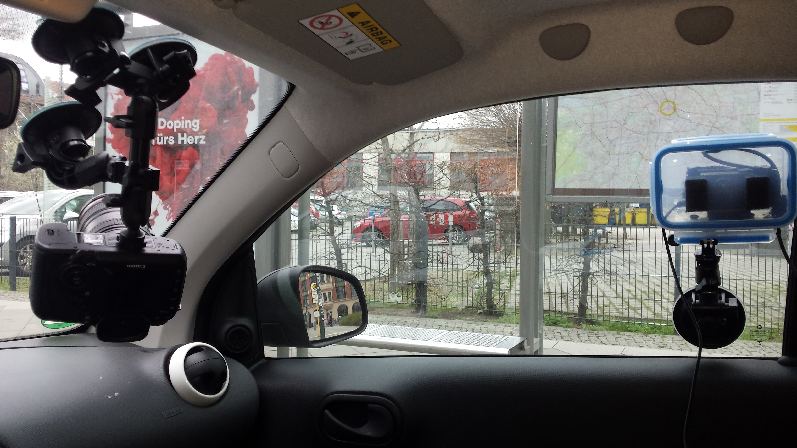
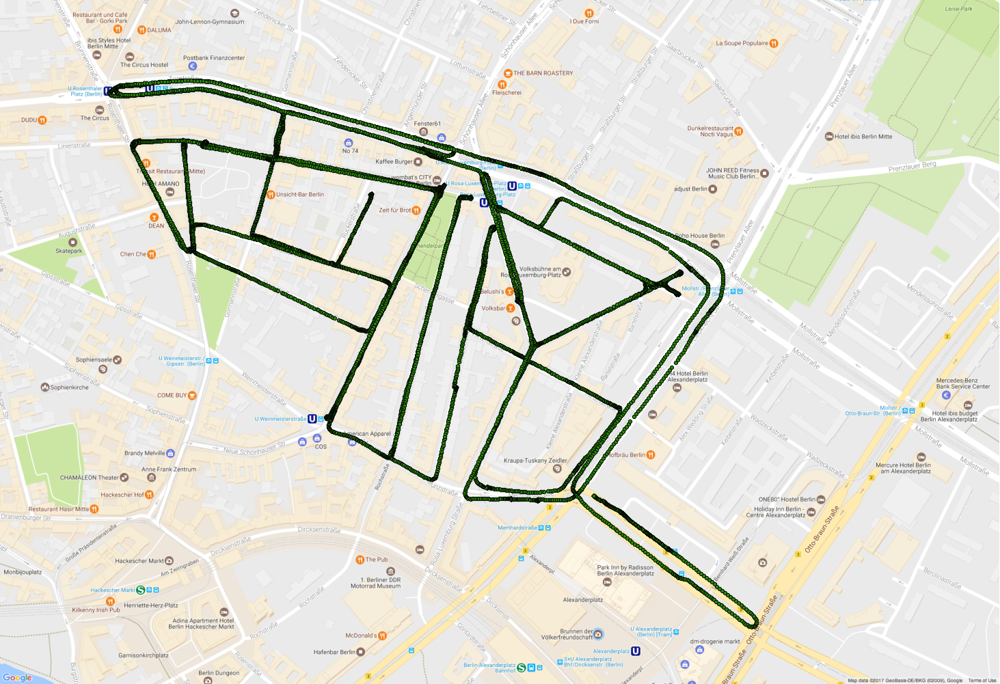
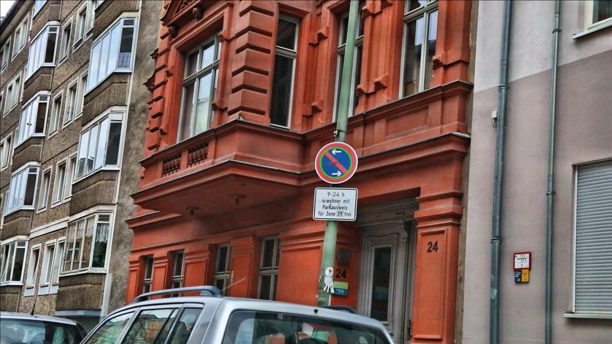
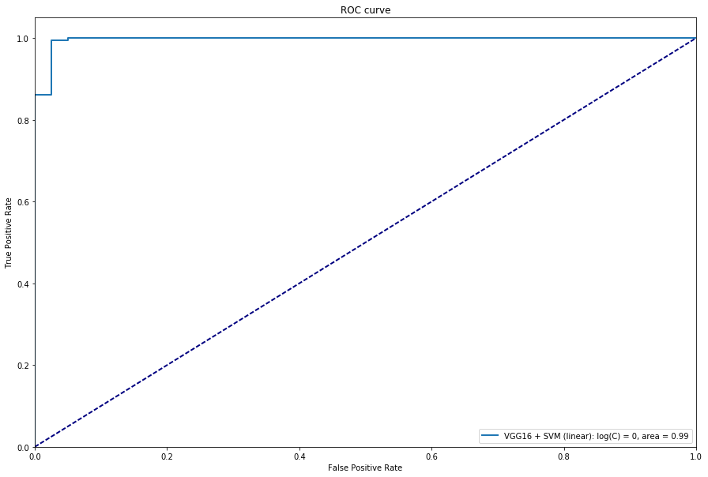
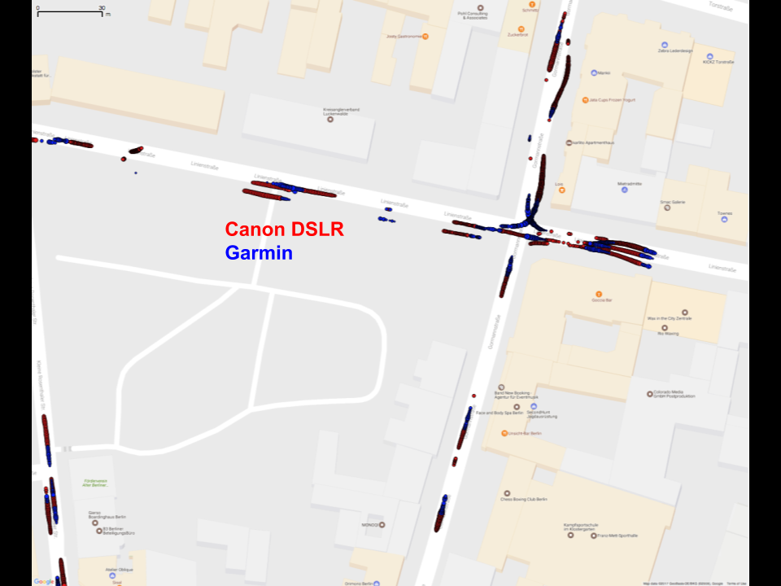
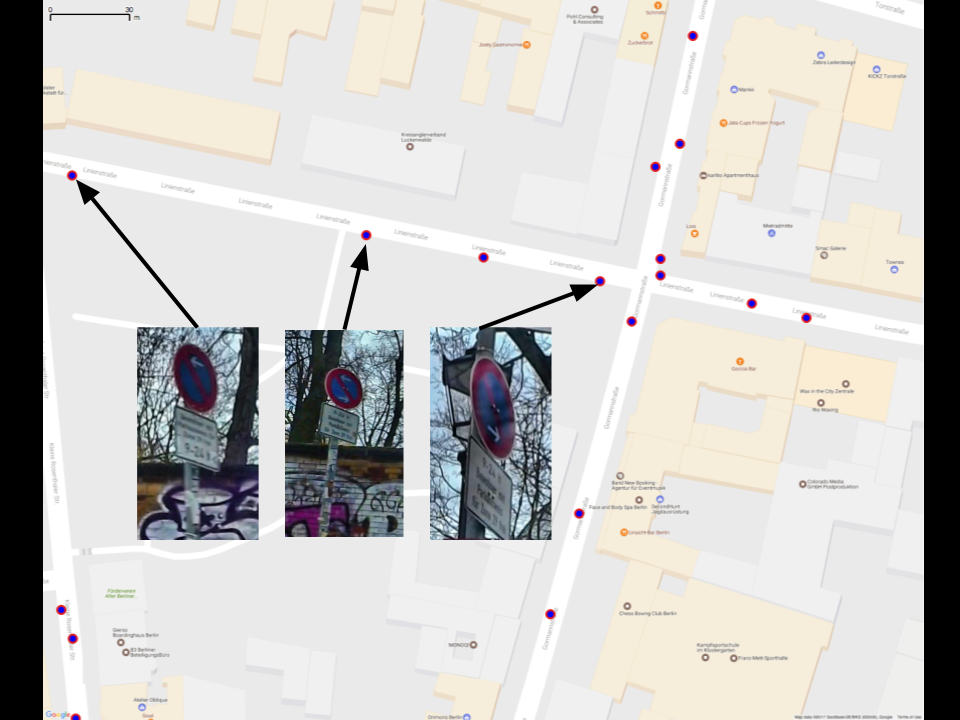

Parking regulation sign detection 
=================================

This is the portfolio project that I completed over six weeks as part of the
Data Science Retreat in Berlin, Jan-Apr 2017.  The goal of the project
was to map the parking regulations in a city using video and GPS data gathered
from a driving car. 

A video of my final presentation can be found [here](https://youtu.be/Z4j_MLUKsa4).

In summary: 

*video was captured with two cameras: one for sign resolution, one
for sign position*    

*GPS was captured with a GPS sensor*  

*"no stopping" sign candidates are found in the video stream using a Hough
circle transform*  

*signs are discrimated from noise using VGG16 transfer learning + an SVM*  

*GPS coordinates are assocated with clusters of frames using a simple geometric
method*  

  

Installation
------------
*OpenCV*

OpenCV must be installed. On Ubuntu try using shellscripts/install-opencv.sh as
per https://milq.github.io/install-opencv-ubuntu-debian/ (copied in this dir).
Script was tested on an AWS EC2 Ubuntu 16.04 LTS. On MacOSX OpenCV v2 can be
installed using conda: `conda install opencv` 

*Keras*

The sign discrimination model uses Keras with Tensorflow backend. Installation
instructions are [here](https://keras.io/#installation). 

*Python requirements*

This package runs on Python 2.7 with packages installed with: 
`pip install -r requirements.txt` This package can be installed, for example 
in development mode using: `python setup.py develop`.  The package can be 
uninstalled with: `python setup.py develop --uninstall` 

*QGIS*

It is useful to visualise outputs geospatially with [QGIS](http://qgis.org). The
eVis plugin can be used to inspect the sign image associated with a point.

Project Organization
------------

    ├── LICENSE
    ├── README.md          <- The top-level README for developers using this project.
    ├── data
    │   ├── tmp            <- a place to write impermanent outputs
    │   ├── interim        <- sign candidate images, dataframes with features, gps csv files
    │   ├── processed      <- sign predictions dataframes
    │   └── raw            <- original videos, gps data
    │
    ├── models             <- SVM model that takes VGG16 features as input
    │
    ├── notebooks          <- Jupyter notebooks. Naming convention is a number (for ordering),
    │                         the creator's initials, and a short `-` delimited description, e.g.
    │                         `1.0-jqp-initial-data-exploration`. Lower-case naming represent temporary
    |                         notebooks that should be converted to scripts.
    │
    ├── references         <- Data dictionaries, manuals, and all other explanatory materials.
    │
    ├── reports            <- Generated analysis as HTML, PDF, LaTeX, etc.
    │   └── figures        <- Generated graphics and figures to be used in reporting
    │
    ├── requirements.txt   <- The requirements file for reproducing the analysis environment, e.g.
    │                         generated with `pip freeze > requirements.txt`
    │
    ├── shellscripts       <- Useful shellscripts, especially for running parallel in AWS.
    │
    ├── sign_detection     <- Source code for use in this project.
    │   ├── __init__.py    <- Makes sign_detecton a Python module
    │   │
    │   ├── data           <- Scripts to download or generate data
    │   │   ├── gps_processor.py
    │   │   └── video_handler.py
    │   │
    │   ├── features       <- Scripts to turn raw data into features for modeling
    │   │   └── make_dataset_and_build_features.py
    │   │
    │   └── models         <- Scripts to train models and then use trained models to make
                              predictions. Presently these are contained in notebooks/.
    
Usage
------------

Example [video
data](https://drive.google.com/file/d/0B088BQXh3BNnSml0YkZ0VThtOGc/view?usp=sharing)
can be downloaded, unzipped, and the directory placed in data/raw/.

Example
[model](https://drive.google.com/file/d/0B088BQXh3BNnak5oOWJjUk1JLVk/view?usp=sharing)
can be downloaded, unzipped, and the directory placed in models/.

The basic steps for processing the example data follow:
- Convert raw gps data from data/raw/170329/gps/3.29.12.47_35.txt using: 
`python sign_detection/data/gps_processor.py`.  This will produce a pandas 
dataframe and save a pickle of it in data/interim/170329/gps/3.29.12.47_35.pkl.

- Process the downloaded sample videos using: `python
  sign_detection/features/make_dataset_and_build_features.py`.  This will output
a csv of data for each sign candidate in data/tmp/170329/dataframes/. Cropped
images of sign candidates are placed in data/tmp/170329/images/**/crop/. There
are various options available when running the script (see bottom of script).
Use the option `-keep_output` to save final output data in data/170329/.

- notebooks/7.3-mmh-vgg16_svm_predictor can be used to run the sign
  discrimination model for both cameras. Note that a GPU will sigficantly speed
up this step (e.g. AWS EC2 p2.xlarge).

- notebooks/8.0-mmh-join_predictions_with_coordinates can be used to join the
  predictions with the original dataframes containing the coordinates. These
dataframes are saved as CSVs which can be imported into QGIS for inspection.

- notebooks/8.1-mmh-garmin_sign_clusters_to_point can be used to convert
  clusters of frames (from one sign) to a single position point.  An output CSV
can be viewed in the QGIS project in qgis/170329.qgs.
